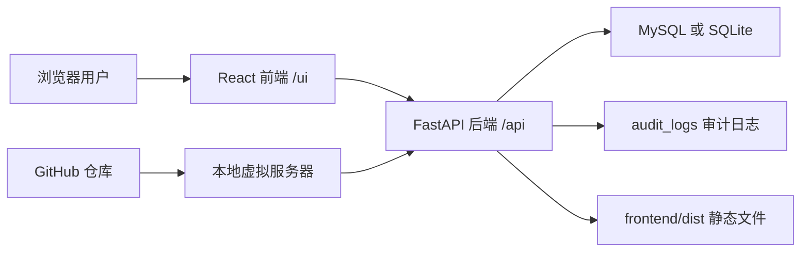

# 部署运维手册

适用对象：未来接手系统的 IT 管理员。

本文档以当前实际代码为准。截图位置均为占位符，后续可在服务器环境补充。

## 系统架构图



当前生产/试用环境：

- 代码仓库：GitHub
- 部署目录：`/opt/semcorp-dorm-management`
- 部署用户：`deploy`
- 数据库：MySQL
- 配置文件：服务器本地 `.env`
- 服务脚本：`scripts/start_prod.sh`
- 更新脚本：`scripts/update_server.sh`

## 技术栈

| 层级 | 技术 |
| --- | --- |
| 后端 | FastAPI |
| ORM | SQLAlchemy |
| 数据迁移 | Alembic |
| 数据库 | SQLite、MySQL via PyMySQL |
| 前端 | React |
| 类型 | TypeScript |
| 构建 | Vite |
| 样式 | Tailwind CSS |
| 认证 | JWT |
| 审计 | audit_logs 表 |

## 服务启动

生产/试用启动脚本：

```bash
cd /opt/semcorp-dorm-management
scripts/start_prod.sh
```

脚本行为：

- 切换到项目根目录。
- 加载服务器本地 `.env`。
- 构建前端。
- 使用 `.venv/bin/uvicorn` 启动后端。
- 监听 `0.0.0.0:8000`。

如果使用 systemd，推荐服务命令：

```bash
sudo systemctl status semcorp-dorm
sudo systemctl restart semcorp-dorm
sudo journalctl -u semcorp-dorm -f
```

健康检查：

```bash
curl http://127.0.0.1:8000/health
```

## 更新流程

推荐使用一键更新脚本：

```bash
cd /opt/semcorp-dorm-management
scripts/update_server.sh
sudo systemctl restart semcorp-dorm
curl http://127.0.0.1:8000/health
```

脚本安全特性：

- 不包含任何密码。
- 不读取或打印 `.env`。
- 出错立即停止。
- 执行前显示当前分支和 commit。
- 如果存在本地未提交改动，立即停止。
- Alembic 失败会停止。
- npm build 失败会停止。
- 不删除数据库。
- 不清空数据。

手动更新流程：

```bash
cd /opt/semcorp-dorm-management
git status
git pull origin main
source .venv/bin/activate
pip install -r requirements.txt
alembic upgrade head
cd frontend
npm install
npm run build
cd ..
sudo systemctl restart semcorp-dorm
curl http://127.0.0.1:8000/health
```

## GitHub 版本管理

当前约定：

- 日常开发推送到 `main`。
- 阶段性版本创建 tag。
- commit message 使用英文，清晰描述变更。

Tag 建议格式：

```text
v0.7-mysql-deployment-prep
v0.8-internal-trial-fixes
v1.0-internal-release
```

服务器更新默认从 `origin main` 拉取。

查看当前服务器版本：

```bash
cd /opt/semcorp-dorm-management
git branch --show-current
git rev-parse --short HEAD
git log -1 --pretty=%s
```

## 数据库迁移

项目使用 Alembic 管理迁移。

执行迁移：

```bash
cd /opt/semcorp-dorm-management
source .venv/bin/activate
alembic upgrade head
```

查看当前迁移版本：

```bash
alembic current
```

重要规则：

- 不要手工改生产数据库表结构。
- 结构变更必须通过 Alembic migration。
- 迁移前建议先做虚拟机快照或 MySQL 导出。
- Alembic 失败后不要继续启动新版本，先保留报错。

## 备份恢复

当前阶段推荐两类备份。

### 虚拟机快照

适用场景：

- 版本升级前。
- 数据库结构迁移前。
- 大量数据导入前。

优点：

- 恢复整体环境快。
- 包含代码、依赖、数据库和系统配置。

### MySQL 导出

导出示例：

```bash
mysqldump -u 用户名 -p 数据库名 > dorm_management_YYYYMMDD.sql
```

恢复示例：

```bash
mysql -u 用户名 -p 数据库名 < dorm_management_YYYYMMDD.sql
```

注意：

- 备份文件不要提交到 GitHub。
- 备份文件不要放在前端静态目录。
- 备份文件应保存在受控位置，并限制访问权限。

## 风险事项

禁止操作：

- 禁止提交 `.env`。
- 禁止提交数据库文件、数据库备份和日志。
- 禁止在代码中硬编码数据库密码、SECRET_KEY、token。
- 禁止在生产库直接执行未知 SQL。
- 禁止用 `git reset --hard` 处理服务器本地问题，除非已明确确认没有数据和配置风险。
- 禁止删除 MySQL 数据库后再尝试修复。
- 禁止把服务器 `.env` 内容复制到聊天、文档或 GitHub issue。
- 禁止新增司机、派车、接送需求、路线优化等 MVP 外功能，除非业务明确要求。

重点风险：

- `DATABASE_URL` 密码含 `@` 时需要写为 `%40`。
- `scripts/create_admin.py` 执行前应加载 `.env`，否则可能连接默认 SQLite。
- 普通 user 前端看不到删除按钮，但后端也必须继续保留权限校验。
- Alembic migration 失败时不能忽略错误继续发布。

## 服务器迁移流程

以下为从旧服务器迁移到新服务器的完整步骤。

1. 在旧服务器确认版本。

```bash
cd /opt/semcorp-dorm-management
git rev-parse --short HEAD
git log -1 --pretty=%s
```

2. 在旧服务器导出数据库。

```bash
mysqldump -u 用户名 -p 数据库名 > dorm_management_backup.sql
```

3. 在新服务器安装基础软件。

```bash
sudo dnf update -y
sudo dnf install -y git python3 python3-pip python3-devel gcc make nodejs npm mysql-server
```

4. 启动 MySQL。

```bash
sudo systemctl enable --now mysqld
```

5. 创建数据库和数据库用户。

```sql
CREATE DATABASE dorm_management CHARACTER SET utf8mb4 COLLATE utf8mb4_unicode_ci;
CREATE USER 'dorm_user'@'localhost' IDENTIFIED BY '<密码>';
GRANT ALL PRIVILEGES ON dorm_management.* TO 'dorm_user'@'localhost';
FLUSH PRIVILEGES;
```

6. 恢复数据库。

```bash
mysql -u 用户名 -p dorm_management < dorm_management_backup.sql
```

7. 拉取代码。

```bash
sudo mkdir -p /opt/semcorp-dorm-management
sudo chown deploy:deploy /opt/semcorp-dorm-management
cd /opt/semcorp-dorm-management
git clone https://github.com/wblangs/semcorp-dorm-management.git .
```

8. 创建虚拟环境并安装依赖。

```bash
python3 -m venv .venv
source .venv/bin/activate
pip install -r requirements.txt
```

9. 配置服务器本地 `.env`。

```bash
cp .env.example .env
nano .env
```

不要把真实 `.env` 提交到 GitHub。

10. 执行迁移和前端构建。

```bash
alembic upgrade head
cd frontend
npm install
npm run build
cd ..
```

11. 启动服务。

```bash
scripts/start_prod.sh
```

如果使用 systemd：

```bash
sudo systemctl restart semcorp-dorm
sudo systemctl status semcorp-dorm
```

12. 验证。

```bash
curl http://127.0.0.1:8000/health
```

浏览器访问：

```text
http://服务器IP:8000/ui/
```

## 页面与接口清单

前端页面：

| 路径 | 页面 | 权限 |
| --- | --- | --- |
| `/ui/login` | 登录 | 未登录可访问 |
| `/ui/` | Dashboard | 登录用户 |
| `/ui/dorms` | 宿舍 | 登录用户 |
| `/ui/rooms` | 房间 | 登录用户 |
| `/ui/people` | 人员 | 登录用户 |
| `/ui/stay` | 停留风险 | 登录用户 |
| `/ui/allocations` | 入住分配 | 登录用户 |
| `/ui/vehicles` | 车辆 | 登录用户 |
| `/ui/dictionaries` | 字典 | admin |
| `/ui/users` | 用户管理 | admin |
| `/ui/system` | 系统 | admin |

主要 API：

| API | 说明 | 权限 |
| --- | --- | --- |
| `POST /api/auth/login` | 登录 | 公开 |
| `POST /api/auth/logout` | 退出 | 登录用户 |
| `GET /api/auth/me` | 当前用户 | 登录用户 |
| `GET /api/dashboard` | Dashboard 数据 | 登录用户 |
| `GET/POST/PUT /api/dorms` | 宿舍查询、新增、修改 | 登录用户 |
| `DELETE /api/dorms/{id}` | 删除宿舍 | admin |
| `GET/POST/PUT /api/rooms` | 房间查询、新增、修改 | 登录用户 |
| `DELETE /api/rooms/{id}` | 删除房间 | admin |
| `GET/POST/PUT /api/people` | 人员查询、新增、修改 | 登录用户 |
| `DELETE /api/people/{id}` | 删除人员 | admin |
| `GET /api/stays` | 停留列表 | 登录用户 |
| `GET /api/stays/risks` | 停留风险 | 登录用户 |
| `POST /api/stays/upsert` | 新增或更新停留 | 登录用户 |
| `DELETE /api/stays/{id}` | 删除停留 | admin |
| `GET/POST/PUT /api/allocations` | 入住查询、新增、修改 | 登录用户 |
| `POST /api/allocations/{id}/checkout` | 退宿 | 登录用户 |
| `DELETE /api/allocations/{id}` | 删除入住记录 | admin |
| `GET/POST/PUT /api/vehicles` | 车辆查询、新增、修改 | 登录用户 |
| `DELETE /api/vehicles/{id}` | 删除车辆 | admin |
| `GET /api/dictionaries` | 字典查询 | 登录用户 |
| `PUT /api/dictionaries/{key}` | 字典替换 | admin |
| `GET /api/users` | 用户列表 | admin |
| `POST /api/users` | 新增用户 | admin |
| `PUT /api/users/{id}` | 修改用户 | admin |
| `POST /api/users/{id}/reset-password` | 重置密码 | admin |
| `GET /api/system` | 系统信息 | admin |
| `GET /api/audit-logs` | 审计日志 | admin |

## 截图占位符

- 登录页截图：待补充。
- Dashboard 截图：待补充。
- 宿舍管理截图：待补充。
- 房间管理截图：待补充。
- 人员管理截图：待补充。
- 停留风险截图：待补充。
- 入住分配截图：待补充。
- 车辆管理截图：待补充。
- 字典配置截图：待补充。
- 用户管理截图：待补充。
- 系统信息截图：待补充。
